<div align="center">

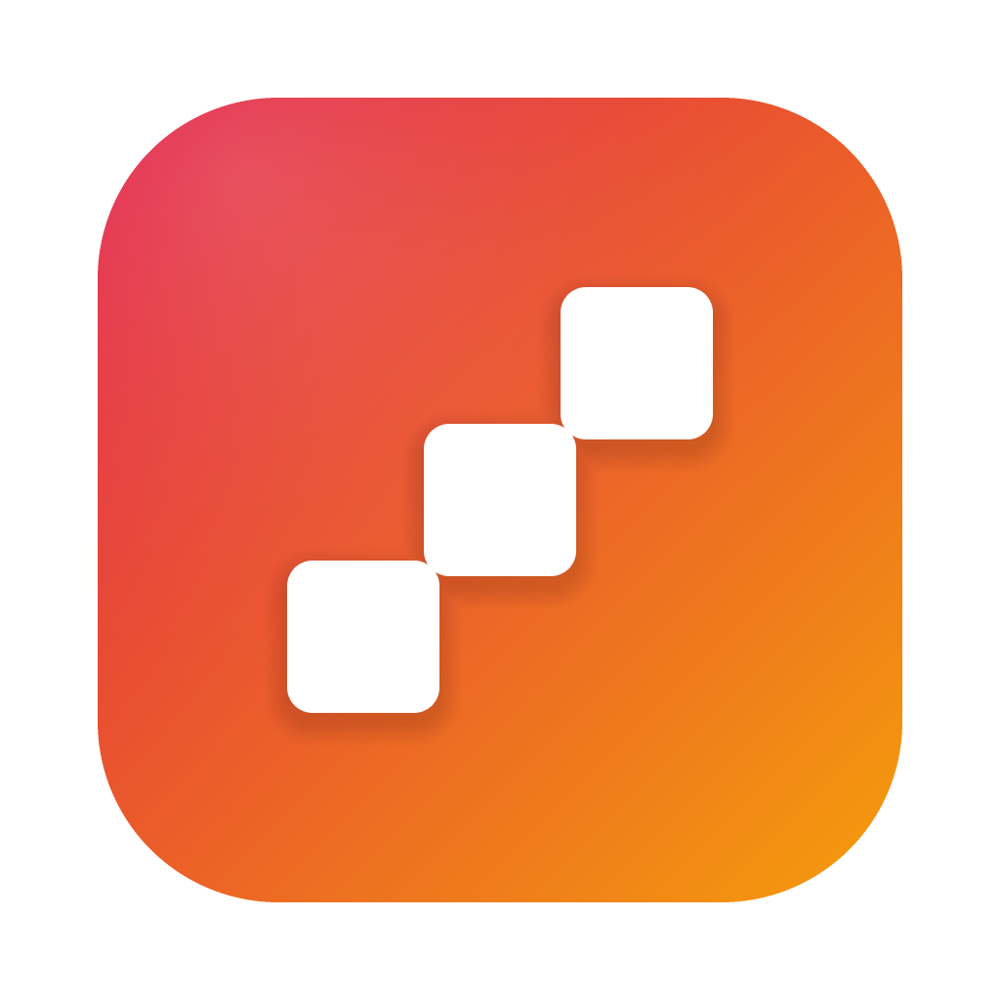

# Neo

**The command centre for project managers running more projects than fit in one head.**

For the person leading four or five projects at once, across different teams and
stakeholders, who is expected to know the state of every one of them on demand.

[](LICENSE)
[](#install)
[](https://github.com/Johannett321/neo/actions/workflows/ci.yml)
[](https://github.com/Johannett321/neo/releases/latest)
[](https://www.electronjs.org/)
[](#your-data)

**[johannett321.github.io/neo](https://johannett321.github.io/neo/)** · [Download](https://github.com/Johannett321/neo/releases/latest)

</div>

<p align="center">
  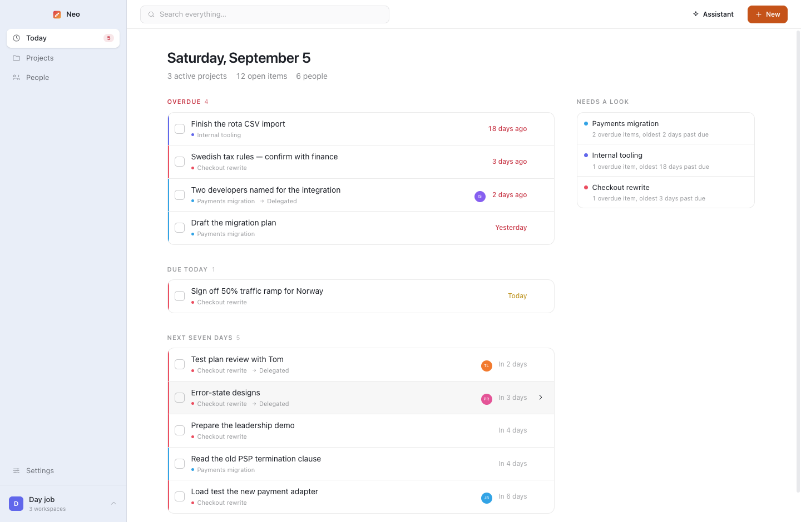
</p>

Jira, Linear and Notion track **the team's work**. None of them track **yours** — the
follow-ups you are owed, the approver you need to catch, the project nobody has touched in
three weeks. That work lives in your head, in a notebook, and in the gap between six
browser tabs. Neo is the layer above the delivery tools that holds it instead.

It answers the three questions no single tool does:

1. **What is on fire today, across every project?**
2. **Who is who on this one again?**
3. **Where the hell were we on this?**

## The problems it is actually for

| The bit that hurts | What Neo does about it |
|---|---|
| **You lead five projects, and reloading one costs you twenty minutes.** Every context switch means opening the board, scrolling the channel and rereading last month's notes before you can say anything useful. | Opening a project starts with a **re-entry brief**: what changed since you last looked, what is overdue, what you are owed and by whom. You are back in the conversation in thirty seconds. |
| **Status reporting is manual, and stale the day after you write it.** RAG ratings and percent-complete only stay true if you keep them true, and you do not, because it is nobody's actual job. | **Attention is derived, never entered.** Overdue work, deadline proximity and how long a project has gone untouched are computed and stated in plain words — *"1 overdue item, oldest 18 days past due"*. There is **no status field to maintain**, anywhere, on purpose. |
| **Something is quietly rotting and you find out too late.** The loud project gets all your attention; the one nobody has mentioned in a month is the one that surprises you. | **Needs a look** ranks projects by the most pressing fact about each, and staleness counts. The quiet one that has not moved surfaces before it becomes a problem. |
| **You delegated it three weeks ago and never followed up.** Work you have handed to someone else disappears from your view the moment you hand it over. | **Delegated items** are a first-class kind of task, with an owner and a due date, sitting on your board and in your Today list — not theirs. You are chasing from a list, not from memory. |
| **Eight stakeholders, and you cannot remember who approves what.** Who signs off the release, who needs the one-pager first, who says no clearly and who says yes and means maybe. | Every project has a **cast**: who is on it, the roles they actually hold, and a line on how to work with them. Read it in the thirty seconds before the meeting. |
| **"Why did we decide it that way?"** Six weeks later nobody remembers, so the settled argument gets reopened — usually by whoever lost it. | A **decision log** per project: what was decided, by whom, the reasoning, and **what was rejected**. The rejected option is the half that comes back. |
| **Meeting actions die in the notes.** You write "Priya: error states by Friday", and it stays a sentence in a document nobody opens again. | Meeting write-ups are prose, and the to-dos inside them **become real items on the board**, owned and dated, counted as still owed until they are done. |
| **Everything you know about a project is in your head.** Which makes annual leave stressful, handover impossible, and your own memory the single point of failure. | Notes, journal, decisions, links and people live with the project and are mirrored to **plain Markdown on disk**. If you get hit by a bus — or just go on holiday — it is all readable without this app. |

Everything is designed around one constraint: *it must survive neglect*. A tool that only
works while you are diligent about it is abandoned in three weeks, and you go back to the
notebook. So capture is cheap, almost nothing needs manual upkeep, and **every screen stays
useful when the data is a month old**.

It is not a replacement for Jira or Linear. Those are where the team executes; put a link
to the board on the project and carry on. This is the view of the portfolio that you, the
person accountable for all of it, do not currently have anywhere.

Everything is **free and open source**, and everything stays **on your own machine** — no
account, no server, no telemetry, no paid tier. Nothing about the projects you manage
leaves your laptop, which matters when your notes say what you actually think about a
stakeholder.

## Install

Download the latest build for your platform from
**[Releases](https://github.com/Johannett321/neo/releases/latest)**:

| Platform | File |
|---|---|
| macOS, Apple silicon | `Neo-<version>-arm64.dmg` |
| macOS, Intel | `Neo-<version>.dmg` |
| Windows | `Neo-Setup-<version>.exe` |
| Linux | `Neo-<version>.AppImage` |

The builds are **not code-signed** — there is no Apple Developer certificate and no
Windows EV certificate behind a free project — so the operating system will object the
first time:

- **macOS** says the app "is damaged" or cannot be opened. It is not damaged; it is
  unsigned. Right-click the app in Applications → **Open** → **Open**, or run
  `xattr -dr com.apple.quarantine /Applications/Neo.app` once.
- **Windows** shows a SmartScreen warning. **More info** → **Run anyway**.

If you would rather not run an unsigned binary — entirely reasonable — build it yourself
from source with `npm run dist`, which is three commands below and produces the same thing.

## Run it from source

You need [Node.js](https://nodejs.org/) 22 or newer. That is the whole list — there is no
database server to install, no Docker, no backend to run in a second terminal.

On a Mac, if the Xcode command line tools are present (`xcode-select --install`) the
build also compiles `neo-audiotap`, the small Swift helper that lets a recording catch
what the computer is playing. It is optional: without a Swift compiler the build says
so and carries on, and recordings capture the microphone.

```bash
git clone https://github.com/Johannett321/neo.git
cd neo
npm install && npm run dev
```

Clone it, then one line, and the app is open — there is no second terminal, no database
to provision and no `.env` to fill in. It creates its own embedded PostgreSQL database on
first launch, inside a plain folder in your Documents. To get a real application bundle
instead of a development window, run `npm run dist`.

On that first launch it introduces itself and asks for two things: your name, and one
area of work to put your projects in. If you would rather look around first, **load the
sample data** from that first panel — a realistic portfolio of projects, people, meetings
and history, which is what every screenshot below is showing.

## A look around

<table>
<tr>
<td width="50%">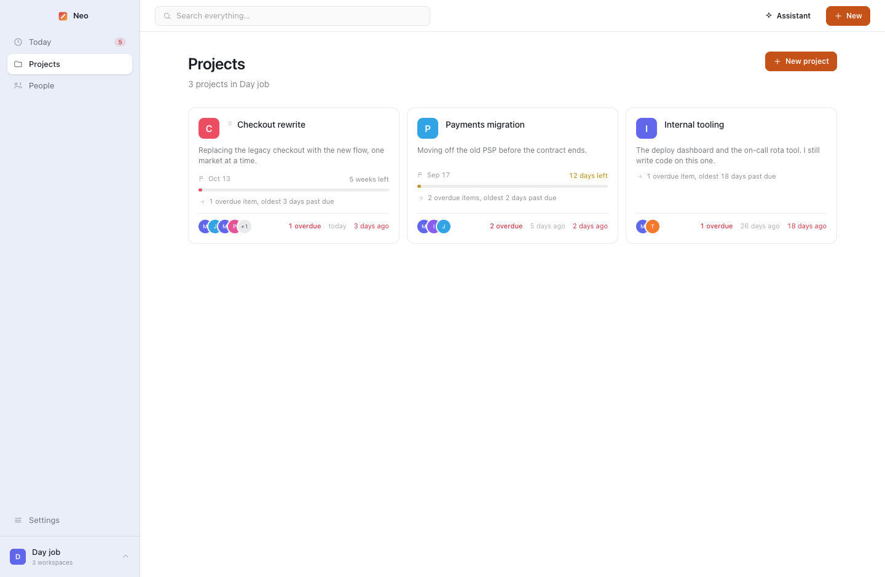<br><b>Projects</b><br>One card each, with what is overdue and how long since you last touched it. No status field to keep up to date — the card works it out.</td>
<td width="50%">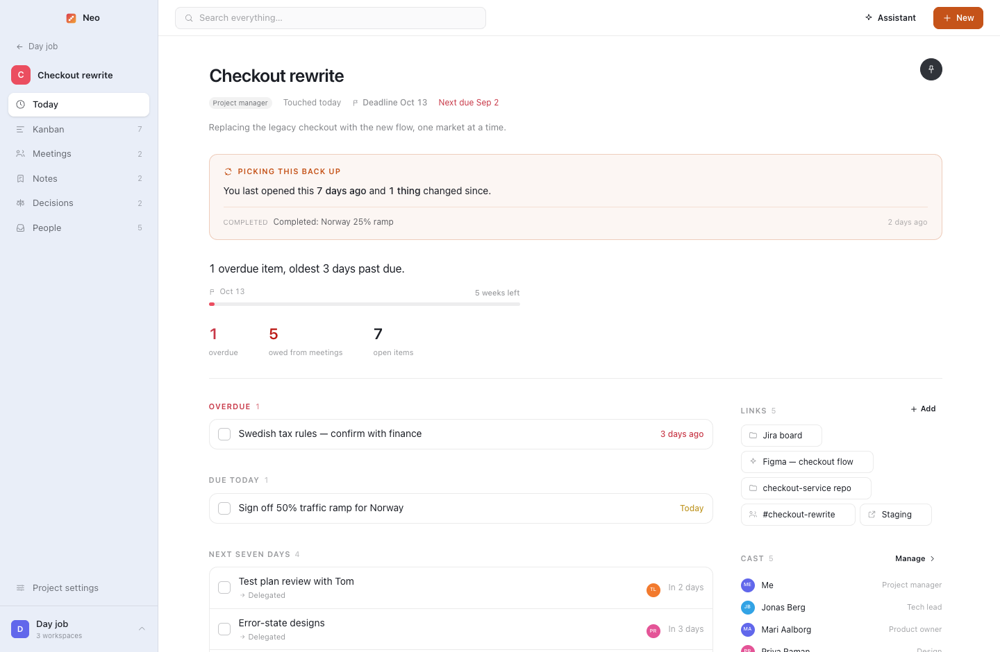<br><b>Re-entry</b><br>Opening a project you have been away from starts with what changed while you were gone, then where it stands in one sentence, then the work that is actually late or due.</td>
</tr>
<tr>
<td>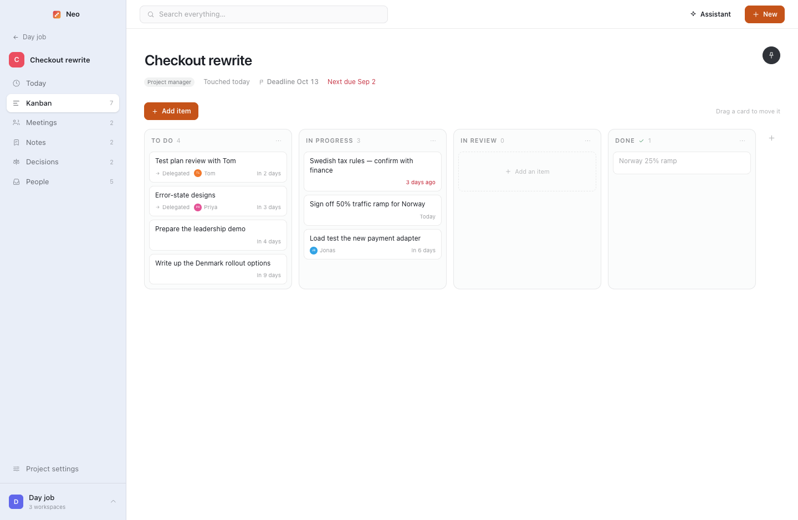<br><b>The board</b><br>Tasks, delegated items and commitments in the same lane. Ticking one off moves it to Done; moving it to Done ticks it off.</td>
<td>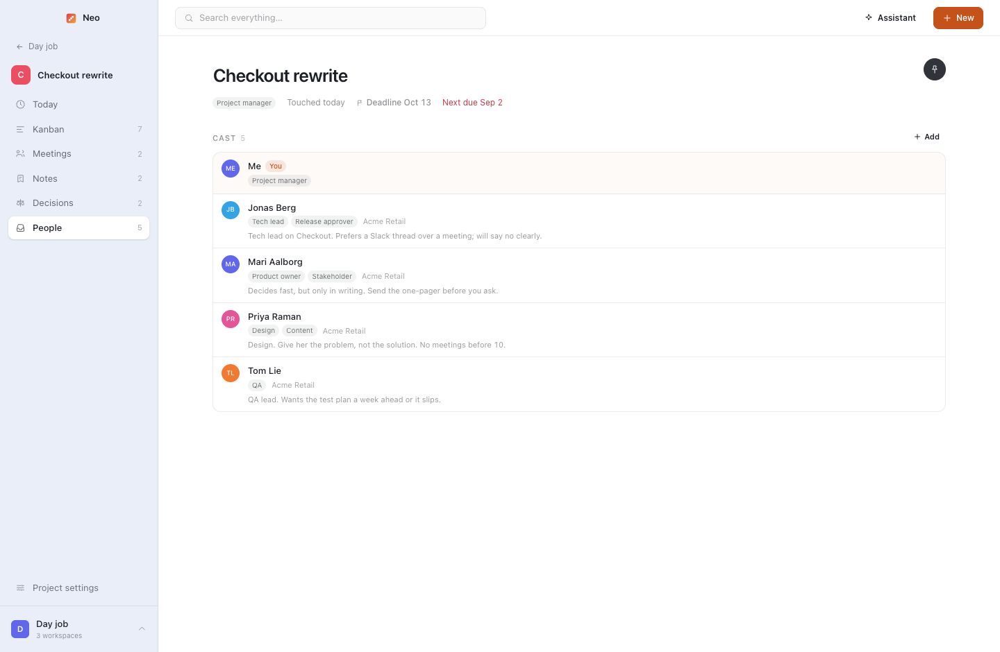<br><b>People</b><br>Who is on this, what they decide, and how to work with them — the thing you actually need before a meeting.</td>
</tr>
<tr>
<td>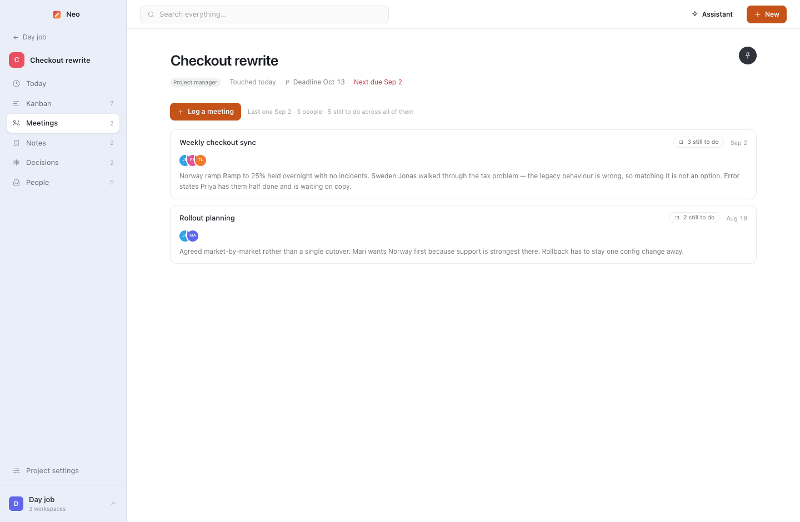<br><b>Meetings</b><br>Write the notes as prose; the to-dos in them become real items on the board.</td>
<td>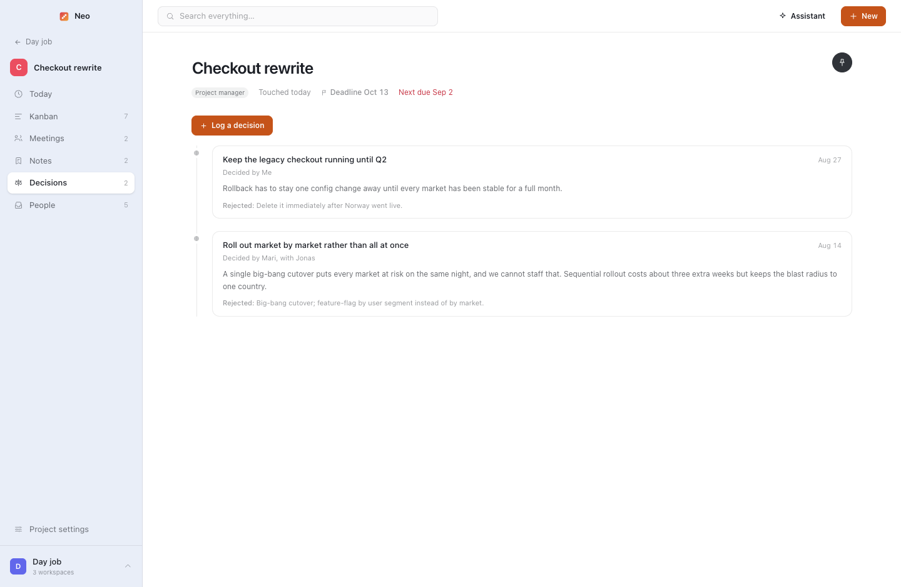<br><b>Decisions</b><br>What was decided, by whom, why — and what was rejected, which is the half that gets re-litigated.</td>
</tr>
<tr>
<td>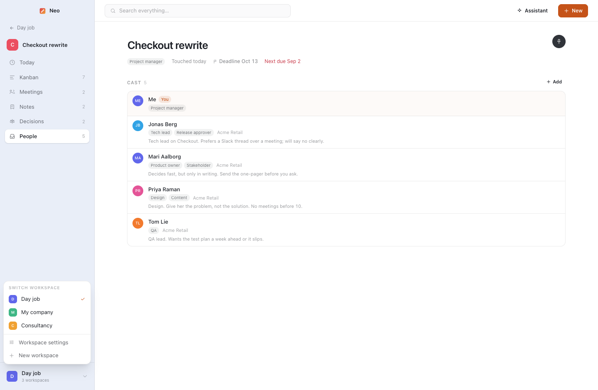<br><b>Workspaces</b><br>A portfolio each — a department, a client, a programme — and a hard boundary: no screen ever mixes two of them.</td>
<td>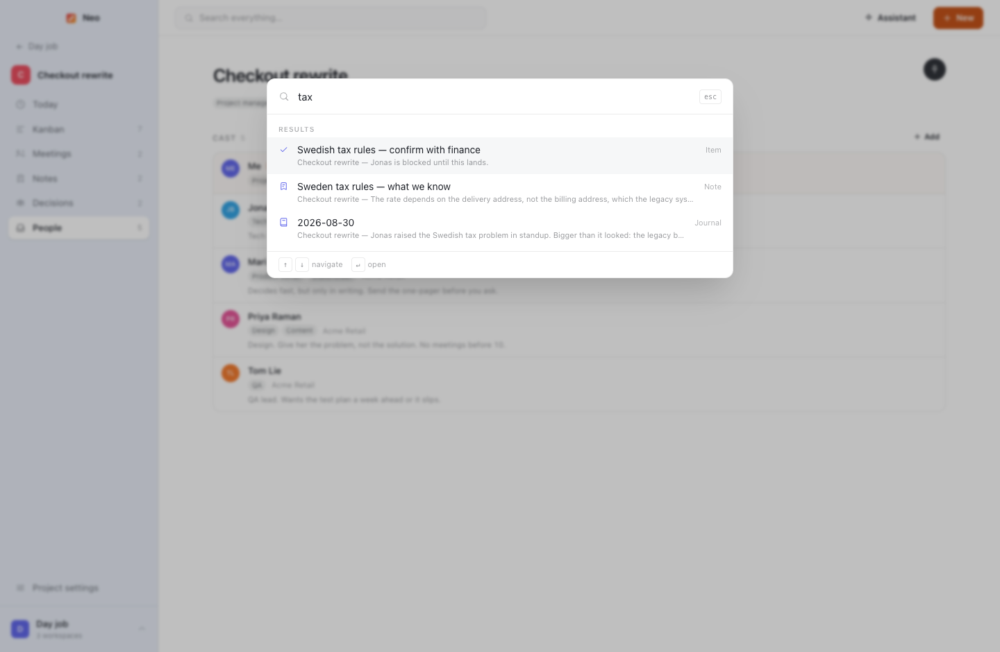<br><b>Search everything</b><br><code>⌘K</code> over tasks, notes, meetings, decisions, journal and people in the current workspace.</td>
</tr>
<tr>
<td>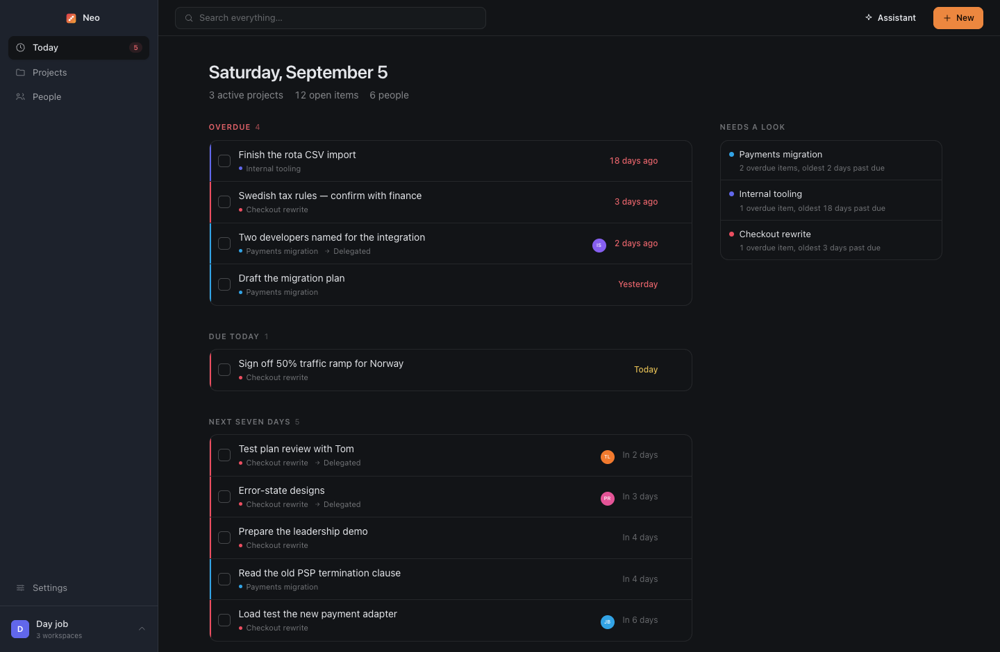<br><b>Dark mode</b><br>A real second theme, not an inverted first one.</td>
<td>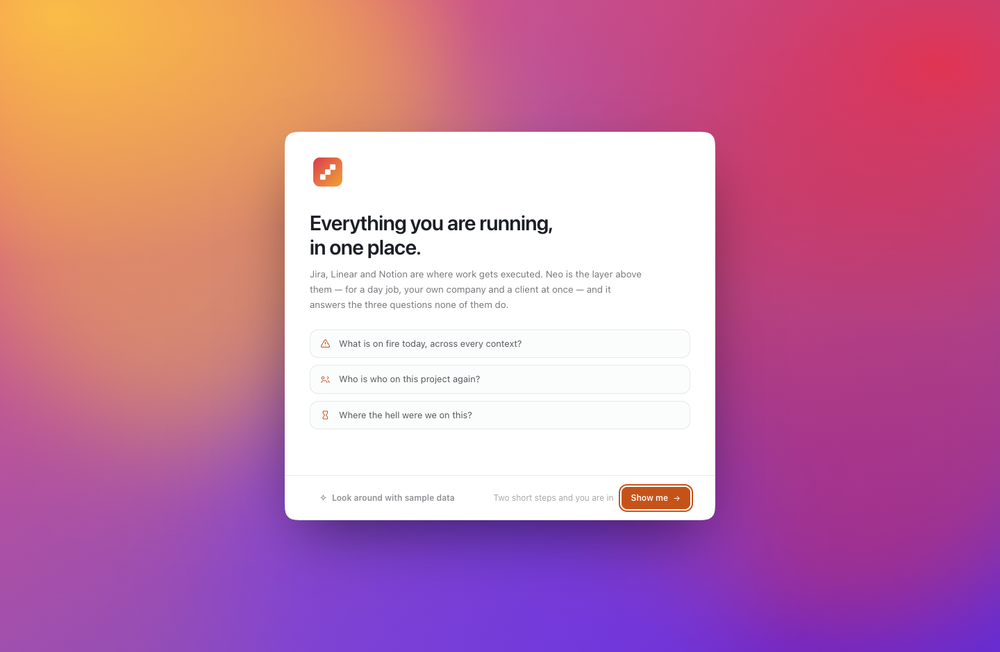<br><b>First launch</b><br>Shown once, and only to a genuinely new install.</td>
</tr>
</table>

## The features, and why each one exists

### Workspaces are separate areas
A workspace is a set of projects that belong together and should never be looked at
alongside anything else — a department, a client, a programme, a side of your job. It has
a name, a colour and an optional uploaded icon, and it is a **hard boundary**: no screen
mixes two of them. If you run projects for two different clients, neither one ever appears
in the other's Today list, search results or reports. Today, Projects, People, Timeline, the weekly review and search are all
fenced to the workspace you are in, and people belong to a workspace rather than
floating above them. Switching happens at the bottom-left of the sidebar, which tints
itself with the workspace colour so it is always obvious where you are.

The app ships with nothing in it; the first thing you do is create a workspace.

A workspace has its **own settings page**, reached from the switcher — its name, colour
and icon, and archiving or deleting it. It says nothing about the other workspaces:
switching between them is the switcher's job, not a settings screen's. That is kept apart from
**Settings** in the sidebar, which is about the app rather than any one area: your
profile, the theme, where your data lives, and how to get it out.

Every settings screen — the app's, a workspace's, a project's — is the same shape: a
short list of panes down the left, one pane at a time on the right. A long scroll of
sections meant the thing you came to change was never where you left it; a pane is a
place, and it stays put. Which pane is open lives in the address, so anything that knows
what needs changing can send you to the pane itself rather than to the front of the
screen with an instruction to go and find it — which is how the assistant's "no key yet"
panel behaves.

### The first launch
The app opens the first time on an introduction rather than a form: what this is for,
the three questions above, and the one constraint everything else follows from — it has
to survive neglect. Only then does it ask for anything, and it asks for two things:
your name, and one area of work to put your projects in. Nothing is written until the last button,
so leaving halfway through leaves nothing behind.

The name field starts filled in from the machine's own account, the workspace name
offers the three people actually use, and the progress rail starts with a segment
already complete, because installing it and opening it is not nothing.

It is shown **once**, and only to a genuinely new installation — the flow writes down
that it finished. Deleting or archiving your last workspace a year later gets the short
"create a workspace" screen instead, which is also where the archived ones are listed
for restoring. Someone upgrading from an older version never sees the introduction at
all: they already have workspaces, which is the proof they do not need it.

`Look around with sample data` is on that first panel too, for anyone who would rather
see it working than be told about it.

### Projects, and focus mode
Projects are either **active or archived** — nothing finer to filter by, and the archived
list is a quiet link beside the count rather than a row of tabs. The page is a grid of
cards carrying what you check before opening anything:
its **colour**, its **deadline**, the one-line summary, what it is asking for, who is on
it, how much is open and when the next date lands. The hat you wear is on the project
itself, not the card — you do not need reminding which role you hold in a project you
are one click from opening.

A project takes its workspace's colour until you give it one of its own in project
settings. It shows on the project's mark and in the fill of its deadline bar — never as a
stripe down the card or a wash across it, which is decoration rather than information. It
is there to be *found*: the project you keep coming back to is the one you should be able
to pick out of a grid without reading a word of it.

A project deadline is the date the whole thing has to land, separate from any task. On
the card it is a **bar measuring from the day the project was created**, because a date
on its own is arithmetic: "the 12th" tells you nothing until you work out that it is a
fortnight away and you have already had three months. The fill carries the project's own
colour while there is room and gives it up for amber inside a fortnight and red once the
date has passed — for that window, urgency is worth more than identity. It also puts the
project on Today's short list from two weeks out, so a project drifting towards its date
surfaces by itself.

Opening a project takes over the sidebar. The way out is the button at the top; while
you are in there the navigation is **Today, Kanban, Meetings, Notes, Decisions, People**,
with **Project settings** at the bottom, and nothing else. One thing at a time is the
point.

A project's Today is its front page, and it is one argument read top to bottom: what
changed while you were away, where the project stands **in a single sentence**, and then
the work that is actually late or due. The sentence is the derived attention reason
promoted out of a list and finished into prose — "2 overdue items, oldest 2 days past
due", "Nothing is late, but 4 to-dos agreed in a meeting are still open" — under it the
run-up bar, and under that the two or three numbers you would otherwise open the board to
find. Overdue, due today and the next seven days then use the same headings and the same
rows as the workspace's Today, so the two screens are one habit rather than two
dashboards. Everything that is reference rather than news — the links hub, the cast, the
activity trail — sits in the rail at rail weight, and the log's composer stays folded
until you ask for it: reading a project is the common case, writing to it is the rare one.

Project settings is everything *about* the project rather than in it: its
icon, name and one-line summary, the hat you wear, its status, and archiving or deleting
it. That split keeps configuration out of a header you look at all day.

Its **deadline and its start date** live there together, because they are the two ends of
the same bar. Most projects are older than the app's knowledge of them — you type in
something you have been running since spring — and a run-up measured from the day you
happened to add it is measuring nothing. Move the start date back and the bar tells the
truth about how much of the time you were ever going to have is gone.

The swap is animated as a drill-down — the workspace list leaves to the left, the
project's navigation arrives from the right and its items settle in sequence — so
entering and leaving a project reads as movement rather than a jump cut. It respects
`prefers-reduced-motion`.

### Archiving and deleting
Both workspaces and projects can be **archived** or **deleted**. Archiving is the one
you want almost always: an archived project disappears from Today, the timeline, the
weekly review, search and the project grid, but keeps everything and comes back in one
click from the Archived tab. An archived workspace vanishes from the switcher and
reappears under Archived, ready to restore. Deleting is permanent and cascades — a
deleted workspace takes its projects, people, notes, meetings and decisions with it —
so both delete buttons ask before committing.

### The board
The Kanban board's columns are the workflow stages — To do, In progress, In review,
Done — renamed, reordered and added to from the board itself. There is no second axis to
file work along: worklanes were exactly that, and keeping them tidy cost more than the
structure was worth. Ticking a task done anywhere in the app moves its card to Done, and
dropping a card in Done ticks it: one truth, two views of it.

A card can be added straight into the column you are looking at — the `+` that appears
on a column's header when the pointer is over it, or the button an empty column shows
in place of the blank space it used to be. The board's own **Add item** still lands in
the first column, because that is what it has always meant.

### Today
One screen for the workspace you are in, grouped by urgency rather than by project:
overdue, due today, the next seven days, and the projects the app thinks need a look,
with the reason attached. Each row carries a rule in **its project's** colour rather
than its workspace's — every row on this screen belongs to the same workspace, so that
colour was the same on all of them and told you nothing.

Having nothing due and having nothing at all are different facts and get opposite
screens. A workspace with projects in it and a clear week says so and sends you off to
work. A workspace with nothing in it yet is not congratulated for being on top of
things: it says the next step is one project, explains what a project is for, and
offers the button — because this is the one screen in the app that has nothing to
derive an answer from.

### You
You are a person too. One profile — name and photo, edited in Settings — mirrored into
every workspace as a person record, so you can be put on projects, given roles, assigned
tasks and listed as a meeting attendee exactly like anyone else. You appear first in the
People list and first in every project's cast with a "You" badge, and you cannot delete
yourself. You are put on every project you create and cannot be removed from one — the
way to say you are not involved is to leave your roles empty.

That replaces the old fixed "my role" dropdown on a project: the hat you wear is now just
your roles on that project, from the same vocabulary as everyone else's, and it shows on
the project card.

### People and roles
The role lives on the *connection* between a person and a project, not on the person,
so the same person can be a tech lead in one place and a stakeholder in another — and
a person usually has **several roles at once**, entered as badges: comma or Enter after
each, Backspace to take one back. The suggestions are the roles already used elsewhere
in the workspace, so your own vocabulary comes back to you without being enforced.

Adding someone to a project starts by **searching the people already in the workspace**,
because most of the cast of a new project is already somewhere else and retyping them
would create a second, slightly different copy of the same person. Pick them and their
photo, organisation and details come along; their role on *this* project is still yours
to set. Only if nobody matches do you fill in a new person.

People can have **uploaded photos**, which then follow them into the cast panel, meeting
attendees and project cards. Without one, the coloured initials are used.

Each person also carries a free-text "how to work with them" — prefers Slack, no meetings
before ten, is the one who actually approves budget — and a reverse view showing every
project they touch and their role in each.

### Re-entry
When you have genuinely been away, a project opens with a brief: how long since your last
visit, and what changed while you were gone.

There used to be a **Where we are / Next action / Open questions** block above it — a
snapshot you overwrote by hand. It went, along with its columns, for the same reason the
health level did: it was three fields to maintain, it went stale exactly when you needed
it most (after a long absence), and everything it held is already recorded. The log keeps
what happened, the items keep what is left, and *"needs a look"* works out what is
pressing without being told.

Two timestamps make this work, both maintained automatically: `last_opened_at` (you
looked) and `last_activity_at` (something actually changed). Re-opening within thirty
minutes counts as the same visit, so the brief does not evaporate the moment you click in.

### Meetings
A meeting is a note that knows the things a meeting has: when it happened, who was in
the room, what was said and what came out of it. Attendees are real people from the
project, so months later the record answers "who agreed to this" — which a plain note
never can. A new meeting starts with everyone on the project ticked; you untick whoever
was absent, or untick all of them in one click and tick the two who turned up.

The **name** has a small pair of stars beside it. Press them and the meeting is named
from what is actually in it — the write-up, or the transcript if it was recorded — in
the three to six words you would scan a list for, and about the subject rather than the
ceremony: "Pricing for the Nordic launch", not "Weekly sync". It only suggests. The name
lands in the field where you can read it, edit it or type straight over it, and it is
kept by the same autosave as everything else on the page. It runs on whichever engine
the workspace uses for recaps, so it works with a local model too.

Writing one up is writing, so it gets a page rather than a dialog — the same Markdown
editor a note uses down the middle, and everything a meeting has that a note does not
in a rail down the right: the name, the date, who was there, and the to-do list. There
is no agenda field and no "where": an agenda is a heading in the write-up like any
other, and the room number stopped being interesting the moment the meeting ended.

**What the room left owing** is a list of real items rather than a slab of text, and
this is the part that pays for itself. The meeting list says "3 still to do" on the row
without you opening anything. Most of those items are done and forgotten inside a week
and never belong on the board — but right-click the one that turns out to be real work
and **Add to the board** makes it a card in the first column, carrying a note of which
meeting it came from. The item then says where it went and which column it is sitting
in, and from that moment the card is the one that knows whether it is finished: tick it
on the board and it ticks on the meeting, and the two can never drift apart.

### Recording a meeting
Press **Record** in the meeting's rail and Neo captures the room, writes out what was
said, and pulls the decisions, the commitments and the things worth knowing out of it.
It is part of the meeting rather than a separate feature: the same page, the same
attendees, the same to-do list — a commitment the recap finds becomes one of those
items by itself.

**It records both sides, with nothing to install.** The microphone is the easy half;
the other half is what your computer is *playing*, which is where everyone else on a
video call lives. Neo captures it through a **Core Audio process tap** — a public,
driver-free macOS facility — and mixes the two into one recording. The first time you
press record, macOS asks whether to allow it. You still hear the call exactly as
before: nothing is muted, rerouted or made to go through anything.

This is the one part of Neo that is not JavaScript. Chromium cannot reach Core Audio
taps and its own loopback capture is Windows-only, so `native/audiotap/main.swift` is
a small Swift helper that the main process spawns, reads audio from, and can lose
without the recording stopping. A separate process rather than a native module on
purpose: a module is compiled against one Electron's headers and breaks on the next,
and a crash inside one takes the whole app down mid-meeting.

It needs **macOS 14.4 or later**. Below that — or if the permission is refused, or the
build was made without a Swift toolchain — Neo falls back to a virtual audio device if
you have set one up: [BlackHole](https://existential.audio/blackhole/) is free, and
**Settings → Recording** explains the Multi-Output Device you make so you can still
hear the call. On Windows there is nothing to set up at all; the operating system
hands an application its own output.

Whatever happens, the panel says which it got — *Microphone and computer audio*, or
*Microphone only* and why — while it is still recording, because that is the only
moment the answer can still be changed. **Settings → Recording → Test it** plays the
whole thing out in two seconds and reports how many bytes it heard, so you find out at
a desk rather than at the end of a meeting.

One wrinkle worth knowing if you build this yourself or run an unsigned release.
macOS reads a privacy usage string out of the bundle only when the Info.plist is
covered by the code signature, and a build with signing skipped keeps Electron's own
signature, which does not cover it — so the request to record audio is refused with no
prompt at all, which looks exactly like the feature being broken. `npm run dist`
therefore ad-hoc signs the bundle with the app's own identifier. That does nothing for
Gatekeeper, and because the permission is remembered against the signature you are
asked again after every rebuild.

**It is built to survive the machine.** Audio is appended to disk every second and
never buffered anywhere else, so the most a power cut can cost is that second. Every
five minutes it rolls over into a new file, which bounds the damage a half-written
file can do and gives everything downstream something to resume from. A Mac that goes
to sleep mid-meeting closes the file it was writing, and opens a new one the moment
the lid does — you will find a segment boundary in the recording and nothing else. A
crash or a flat battery is the one case Neo will not decide for you: the next launch
shows the meeting with **Recording was interrupted**, the audio it got, and two
buttons — *Carry on*, because the meeting may still be happening, and *It is over*.

Transcription starts on its own when you stop, and it is done one five-minute part at
a time, each written down before the next begins. Then speakers, then the recap. All
three run in the background whether or not the app is on that screen, all three
remember where they got to, and a step that fails for a reason waiting will not fix —
a wrong key, a model that does not exist — stops and says so instead of retrying
forever.

**Where it runs is yours to choose**, per workspace, under *Workspace settings →
Recording*. A client's conversations can be transcribed and summarised entirely on
your own machine while the day job's go to OpenAI. The two halves are set separately,
because they are different questions: transcription sends the *audio* somewhere, the
recap sends the *words*. One thing worth knowing — **Ollama cannot transcribe**; it
runs language models and only those. So *on this Mac* for transcription means an
OpenAI-compatible speech server you run yourself (whisper.cpp's `whisper-server`,
faster-whisper-server, Speaches, LocalAI) and the setting asks for its address.
Ollama is the natural choice for the recap half.

**The recap becomes part of the meeting, on its own.** Nothing to press. The moment it
is written it is appended to the write-up as ordinary Markdown you can edit, which is
also why the meetings list starts showing what the meeting was about — the list has
always shown the top of the write-up. A meeting you never got round to naming is given
a name; one you named keeps yours. And every **commitment** — somebody saying out loud
that they will do something — becomes one of the meeting's to-do items in the rail on
the right, so it is counted as owing on Today and can be put on the board like any
other. Folding it in is a step in the same queue as everything else, so a recap that
was written before the machine went to sleep is folded in when it wakes.

That happens once. After the first time, the write-up is yours: re-running the recap
updates what the Recording screen shows and leaves your notes alone.

**What the recap asks for is editable** and the default is opinionated: decisions,
commitments and key insights, with small talk, scheduling chatter and restatements of
the agenda thrown away. The *shape* of the answer is not editable, because the app
reads it as data rather than prose — that is what lets a commitment become a to-do and
a decision go into the decision log without being retyped.

**Playing it back** puts the transcript beside the audio and moves through it as it
plays; click any line to jump there. Speakers are labelled *Speaker 1*, *Speaker 2*
and so on, and the panel is honest about where those come from: there is no
voice-print model on a stock Mac, so the turns are worked out from the words rather
than measured from the audio. They are usually right at the handovers and can be
wrong in the middle of a monologue. Click one and put a real name to it from the
people on the project — that is one row, and it is reversible.

The recording says how big it is, everywhere it appears, and **delete means delete the
audio** — the sound is the part that costs megabytes, and the transcript and the recap
are a few kilobytes of text you will actually go back to. So the delete on the meeting
page frees the space and keeps every word: the transcript, the speakers and the recap
all stay exactly as they are. It is refused while there is nothing transcribed yet,
because then the audio is the only copy of the meeting.

Throwing the whole thing away — transcript and recap included — is a separate action,
at the bottom of the Recording screen underneath everything it would destroy. It is
for the recording you should not have made, not for saving space. Deleting a meeting,
a project or a workspace takes its audio off the disk with it; a cascade in the
database frees no space on its own, so Neo sweeps the folders itself, and again at
launch as a backstop.

### Decision log
A first-class record: what was decided, when, by whom, why, and **what was rejected**.
The rejected options are the half everyone forgets and the half that gets re-proposed
six months later.

### Journal, notes, links
The project Home page carries an append-only dated log of how you got here, alongside
the links hub — the board, the repo, the Figma file, the client's Drive folder — which
is the cheapest feature here and kills a surprising amount of the daily hunt. Notes get
their own page for everything that is not a meeting.

### Writing a note
A note opens as a page, not a dialog, and it takes the whole window: no project
heading, no tabs, no search bar. The project heading is for moving around and this is
the one screen where you are not, so the note starts at the top of the window and the
only chrome left — the way back, the word count, whether it is saved — floats over it.

It is **Markdown**, which is also how it is stored and how it is mirrored to disk, so
what you type is what survives. It renders itself as you write it, in the line you are
writing: type `## ` and that line becomes a heading with the cursor still in it, type
`- ` and it becomes a bullet. There is no preview and no preview pane, because a
preview is a second copy of the note that you have to look away from the first one to
see.

The syntax that has a visual form of its own — a bullet, a number, a checkbox, a quote
bar — is drawn instead of shown. The rest (`##`, `**`, a link's brackets) hides on every
line except the one the cursor is on, where you need to be able to edit it. Nothing is
rewritten: every character is still in the note, and the file on disk is the file you
typed.

Lists carry themselves on when you press Return and end when you press it on an empty
one, Backspace where the words start unmakes the item rather than chewing through `- `,
`⇥` and `⇧⇥` nest and lift, `⌘B` / `⌘I` / `⌘⇧K` wrap the selection, checkboxes tick when
clicked, and pasting a URL over selected text turns it into a link. Copying takes the
Markdown rather than what happens to be on screen.

Under it, this is a `contenteditable`, because a textarea has one font for the whole
box. Every edit is intercepted before the browser can apply it, applied to the Markdown
string instead, and the document redrawn from that string — so what you can see is
always a rendering of the text and never a source of it. Undo is the app's own for the
same reason: redrawing the document would have thrown the browser's history away.

It saves itself, continuously. A dialog can afford a Save button, because the only ways
out of one are deliberate; a page has a sidebar, a back gesture and `⌘K` next to it, and
losing an afternoon's writing to a stray click is not a trade worth making. Repeated
saves of the same note within half an hour collapse into a single line in the activity
log, so the thing that makes the re-entry brief readable is not drowned by the thing
that makes the writing safe.

### Confirmations
Anything destructive opens a dialog that says what is about to happen and what it will
take with it, rather than a button that quietly turns into "Sure?". It works from inside
other dialogs, and Escape or a click outside cancels.

### Needs a look
Never self-reported. A status you have to remember to update is always wrong, so Today
works out for itself which projects are asking for attention and says why in plain words:
*"2 overdue items, oldest 9 days past due"*, *"deadline in 3 days with 4 items still
open"*, *"standing still for 12 days"*.

Only the most pressing fact is shown, because a list of six projects each with three
caveats is not a short list. A project that is paused, dormant or done is in that state
on purpose and never gets dragged back into view. Thresholds live in one place,
`src/main/lib/attention.ts`.

This used to be a coloured health dot on every project surface — green, amber, red, with
the explanation hidden behind a tooltip. The colour was a thing you had to learn to read,
and it competed with the workspace colours for meaning; the reason itself turned out to be
the only part worth showing. Colour on a project now means identity, nothing more.

### Capturing something
`⌘N` opens one dialog for the four things worth capturing in a hurry — a **task**, a
**decision**, a **log entry** or a **meeting**. The project comes first and is shaped
differently from the fields under it, because it is the question you answer before any
of them; inside a project it is already answered and is not asked at all. Outside one it
arrives **already filled in with the project you had open last**, which is nearly always
the one you mean — and it says so on the row, because a default you cannot see the
reason for is a default you learn to distrust. Any other project is one click away. A task takes a
title, a note, an assignee (including yourself) and an optional due date, and always lands
in the board's first column; a meeting takes just a name, which is optional, and a date
that defaults to today — the notes and attendees can come afterwards.

Assigning a task to someone else records it as delegated, so it lands in the right part
of Today without you having to say so. Whatever you create confirms itself with a toast
in the corner that takes you to where it went — a quick capture should not feel like it
vanished.

Editing an item never asks what *kind* it is either: work someone else owns is delegated,
work you own is yours. It follows from the assignee, so the two cannot drift apart.

Dates are picked with the app's own control rather than the platform's: clicking the field
opens a popover with **Today, Tomorrow, Next Monday, In a week, In a month** alongside a
month calendar, because the shortcut is nearly always the answer.

### Right-click
Almost everything has a context menu: a project card (open, board, settings, pin, archive,
delete), a task row or board card (mark done, edit, move to a column, delete), a board
column (rename, move, mark as the done column, delete), a person, a note, a decision, a
meeting, a link. Destructive items say what will happen and ask before doing it, and that
question is asked in one place rather than reimplemented at each call site.

### Command palette
`⌘K` searches projects, people, tasks, notes, decisions and journal entries at once —
within the current workspace only. Before you have typed anything it is not an empty box
with an instruction in it: it lists the projects you have opened most recently, most
recent first, because that is what you were going to search for.

### The assistant
A panel down the right-hand side, opened with the button beside **New** or with `⌘J`. It
pushes the page rather than covering it, because what you are asking about is usually
what you are looking at.

It runs on **your own OpenAI key**, entered in workspace settings under Assistant, and
the key lives on the workspace rather than on the app — a workspace *is* a separate
separate area of work, and the key one client is billed through should not be the one
another client's questions go out on. The key is stored in the same folder as everything else and is never
sent back out of the main process; the settings screen is only ever told whether there
is one.

It can **read everything in the workspace it was opened in** — the board, the people and
how to work with them, the notes, the meeting write-ups, the decision log, the journal,
the links, the activity — and nothing outside it. Ask it what needs you this week, where
you got to on something, who to chase and about what.

It can also **change things**, and every change stops and asks first. The confirmation is
a sentence in plain words with the ids resolved out of it — *"Add "Draft the Q3 brief" to
Website relaunch, for Priya, due 2026-10-01"* — because a confirmation you cannot check is
one you learn to click through. Nothing is written until you say yes, and declining is
final: it is told so, and told not to try another way round.

Every write it makes goes through the same channel your own click goes through, so a task
it creates is not a special kind of task. It logs activity, bumps the project's clock and
lands in the Markdown mirror exactly as a hand-made one does, because it is the same code
path rather than a second copy of it.

Replies stream as they are written and render as real Markdown — headings, lists, tables,
code. You can **attach files**: images, PDFs, and text or code files, dropped onto the
panel or picked with the paperclip. Conversations are saved, listed in the panel's header
and switchable; each one names itself from the first exchange rather than being called
"New chat" forever or making you name it before you know what it is about.

### Claude Desktop

The same tools, from the other side. Neo ships an **MCP connector**, so the Claude desktop
app can read what is in Neo and change it without the panel being open — useful when the
conversation started somewhere else, or when you want a model other than the one your own
key buys.

**Setting it up takes one click.** Open **Settings → Claude** (`⌘,`) and press *Connect
Claude Desktop*. Neo adds one entry to Claude Desktop's own configuration, leaving
everything already in it alone, then tells you to restart Claude Desktop — which only
reads that file at startup. The pane tells you where you stand the rest of the time:
connected, not connected, or pointing at a copy of Neo that has since moved.

Nothing has to be installed for that to work, not even Node. The entry runs the connector
on Neo's own Electron as plain Node, because `"command": "node"` is the reason half of
these setups never start — Claude Desktop launches its servers with a login shell's PATH,
which on a machine where Node came from nvm or Homebrew does not have Node on it.

If you would rather do it by hand, the pane has the exact JSON to copy and a link to the
file it goes in. And to hand the connector to someone else, build it as an installable
extension:

```bash
npm run mcp:pack     # writes dist/neo.mcpb
```

which they drop on **Claude Desktop → Settings → Extensions**. That route runs on Claude
Desktop's own bundled Node, so it needs nothing installed either.

**Neo has to be open.** The connector holds no database of its own — it forwards every
call over a local socket to the running app, which answers it with the same tools the
panel uses, on the same channels. That is not caution for its own sake: PGlite is an
in-process engine with no lock, and a second process reading that folder is the one thing
that can damage it. With Neo shut, the tools say so and do nothing.

Everything else follows from being the same code path. A task Claude Desktop creates logs
activity, bumps the project's clock and lands in the Markdown mirror, because it *is* the
click you would have made. Reads are fenced to one workspace exactly as the panel's are.
Every tool takes an optional `workspace` — a name is enough — and uses whichever one Neo
is showing if you leave it out; the answer always says which one it used, so the choice is
never silent. `list_workspaces` is there to find the others.

Approval works differently here, and it is worth knowing which. The in-app assistant stops
before every write and shows you a sentence in plain words. Claude Desktop cannot be asked
to show that — it has no way for a connector to put a question on screen — so the thing
that gates a write is Claude Desktop's own "allow this tool" prompt. Reads are marked
read-only so it can stop asking about them, and `delete_task` is marked destructive so it
warns. Neo still builds the plain-words sentence before it writes anything, which is what
catches a bad date or an id from another workspace *before* the change rather than after,
and hands it back with the result so the transcript says what changed in words rather than
in arguments.

## Your data

Everything lives in **`~/Documents/Neo`**:

- `db/` — an embedded PostgreSQL database (PGlite: real Postgres compiled to WebAssembly,
  running inside the app). No server, no Docker, nothing to install or start.
- `markdown/` — a plain-Markdown mirror of every project overview, note, meeting,
  decision and journal entry, rewritten automatically on every change. If this app is
  ever abandoned, the writing that matters survives in a format any editor opens.
- `icons/` — the images you upload for workspaces, projects and people. Files nothing
  references any more are swept on launch.
- `attachments/` — files you have dropped into a conversation with the assistant.
- `recordings/` — the audio of recorded meetings, one folder per recording and one file
  per five minutes. They are ordinary Opus files; drag one out and any player will open
  it. Deleting a recording's audio from inside Neo removes the folder and keeps the
  transcript.
- `exports/` — JSON dumps of the structured data, on demand.

The Markdown mirror covers recordings too: a recorded meeting writes its recap into the
write-up file and its transcript into a second file beside it, so the words survive this
app even if the audio has been deleted from inside it.

Nothing leaves the machine on its own. Three things ever do, and all three are things you
asked for. A question typed into the assistant goes to OpenAI on your own key, along with
whatever it looked up to answer it, and only from the workspace you asked in — with no key
saved, that channel is shut. Anything the Claude Desktop connector reads goes to Anthropic
as part of the conversation you are having there; uninstalling the extension, or simply
keeping Neo shut, closes that one. And a meeting you record is sent wherever that
workspace's *Recording* settings say — to OpenAI, or to a server on your own machine, or
one of each for the audio and the words.

## Calendar

Outlook integration is deliberately absent. Most project managers' calendars sit behind a
corporate tenant that will not hand them to a local app, and asking IT to change that is
not a fight worth having to see your own meetings twice. The **commitment** item type
covers the part that matters — a date with no work attached, like a steering group, a demo
or a go-live — and it flows through Today and the Timeline exactly as a calendar event
would. If access ever becomes possible in a given org, it drops in behind the same
`commitment` shape without disturbing anything else.

## The name and the icon

Neo, as in new — where something new gets written down, and where you pick it back up
after you have been away from it. The icon is three white squares stepping down a diagonal on a
rose-to-amber gradient: separate things, held in one line of sight.

`build/icon.svg` records the design; `scripts/make-icon.mjs` produces `icon.png`, the
iconset and the `.icns`. There is no SVG rasteriser on a stock macOS, so the script draws
the shapes from signed distance fields and renders each size natively rather than
downscaling one master, which is what keeps the 16px version crisp.

The two colours are adjacent on the wheel deliberately. Complementary pairs — blue and
orange, say — cancel to grey-brown where they blend, which is what made earlier attempts
look muddy no matter how vivid the ends were.

`scripts/dev-branding.mjs` puts the name and icon on the development bundle. In
development the app runs inside `node_modules`' `Electron.app`, and macOS takes the
menu-bar title from `CFBundleName`, the dock label from the **executable**, and the
tooltip from LaunchServices' cache keyed on the **bundle identifier** — so all four have
to change, and the stale LaunchServices entry has to be dropped, before the app stops
calling itself Electron. It runs on `npm run dev` and after every install.

Renaming the executable has one consequence worth knowing: `app.isPackaged` is derived
from that name, so a development run reports itself as packaged. The window therefore
decides which renderer to load from `ELECTRON_RENDERER_URL` — the dev server's own
address, which only exists when there is one — rather than from `isPackaged`, which
would send every `npm run dev` to the last production build in `out/` with no hot
reload and no sign that anything was wrong.

## Running it

Node.js 22 or newer, and nothing else — the database is embedded, so there is no server
to start and no second terminal to keep open.

```bash
npm install
npm run dev             # development, with hot reload
npm run build           # typecheck + production build
npm run package         # unpacked application into dist/
npm run dist            # packaged, signed-if-possible application
npm run typecheck       # both TypeScript projects
npm run verify          # exercise the whole backend headlessly
npm run verify:upgrade  # open a database written by an older version
npm run mcp:pack        # build the Claude Desktop connector into dist/neo.mcpb
```

`npm run dist` produces a `.dmg` and a `.zip` on macOS, an NSIS installer on Windows and
an AppImage on Linux, for whichever platform you run it on. It is developed on macOS,
which is where the window chrome, the menu bar and the icon pipeline have actually been
exercised; the other two build from the same source but have had far less use, and
reports are welcome.

Releases are built by GitHub Actions on native runners for all three platforms —
`.github/workflows/release.yml`, triggered by pushing a `v*` tag. `ci.yml` runs the
typecheck and both verify scripts on every push and pull request.

Settings has no reset button: emptying the database is a thing you do to the data folder,
not something to leave a click away from your own work.

### The menu, and shortcuts

There is a real application menu: **File** for creating things and reaching your data
folder, **Edit** with the standard roles (so text fields keep undo, redo and the system
emoji picker), **Go** for jumping between screens, plus View, Window and Help. Menu items
drive the same actions the buttons and keyboard do rather than a parallel set of their own.

| Key | |
|---|---|
| `⌘K` | Search everything |
| `⌘N` | New item, from anywhere |
| `⌘⇧N` | New project |
| `⌘1`–`⌘3` | Today, Projects, People |
| `⌘[` / `⌘]` | Back and forward |
| `⌘,` | Settings |
| `⌘⇧O` | Reveal the data folder |
| `⌘↵` | Save and close a dialog |
| `Esc` | Close a dialog, or leave a settings screen |

## How it is built

- **Electron 44**, main process + renderer, with a typed IPC bridge as the only surface
  between them. The database, filesystem and shell never reach the renderer.
- **PGlite** for storage, driven with plain SQL. The DDL in `src/main/db/ddl.ts` is the
  single source of truth and is applied idempotently on launch.
- **React 19 + TanStack Query** in the renderer, with React Router in hash mode and
  Framer Motion for the sidebar transition.
- **Tailwind 4 + daisyUI 5** on a custom theme, light and dark.
- `src/shared/api.ts` maps every IPC channel to its input and output types, so the
  renderer cannot call a channel that main does not handle.

Calendar dates are stored as `text` in `YYYY-MM-DD` rather than as `date` columns —
a desktop app renders dates in local time, and round-tripping a `date` through a driver
that returns UTC-midnight is how you end up showing "due yesterday".

### Looking after the data

PGlite is an in-process engine with no lock of its own, so two copies of the app writing
the same folder will corrupt it. The app therefore takes a single-instance lock and a
second launch focuses the window already open **without ever opening the database**.
Quitting is deferred until the database has been flushed, and Ctrl-C in development gets
the same treatment, because a half-written shutdown is the other way this breaks.

If a b-tree index is damaged anyway — a force quit, a crash — Postgres reports `XX002` on
startup. Rather than refusing to open, the app rebuilds the index and carries on: the row
data is never what is damaged in that failure, only the index over it. That path has been
run against a genuinely corrupted database, not just a simulated one.

### Migrations

The schema is applied idempotently on launch: `DDL` creates tables and indexes in one
batch, then `MIGRATIONS` runs one statement at a time, in four groups — columns, then
constraint changes, then backfills, then indexes. Keep that order: an index or an
`UPDATE` that mentions a column added further down the list will fail on an older
database, which is exactly the bug the grouping prevents. That split is not cosmetic —
PostgreSQL parses *every* statement in a multi-statement batch before executing any of
them, so a statement referencing a column that an `ALTER` in the same batch is about to
add fails to parse. Anything that depends on a migrated column — an `UPDATE`, an index —
must live in `MIGRATIONS`, below the `ALTER` that creates it.

`npm run verify:upgrade` builds a database in an older shape and opens it with the
current code, which is the only way that class of bug gets caught before launch.

### Tests

`npm run verify` stubs Electron and drives the real IPC handlers end to end — sample data,
the attention reasons, workspace isolation, the Today and review dashboards, the re-entry
brief, board stages, meetings, search, cascade deletes and both exports — in plain Node,
with no window and no display.

There is no linter and no test framework. `test/verify.ts` and `test/upgrade.ts` are
single scripts of `ok(label, condition)` assertions run end to end, so there is no way to
run one in isolation — run the whole script, which takes a few seconds. Add an assertion
to `verify.ts` for any backend behaviour you change, and to `upgrade.ts` when you change
the schema.

## Contributing

Contributions are welcome. [`CONTRIBUTING.md`](CONTRIBUTING.md) covers how to get set up
and what to run before opening a pull request; [`CLAUDE.md`](CLAUDE.md) is a longer tour
of the architecture and the conventions that are load-bearing, written for an AI coding
assistant but just as useful to a person.

The one thing worth knowing before you propose a feature: **there is no status field a
user has to maintain by hand**, anywhere, and there is not going to be one. Attention is
derived from overdue work, deadline proximity and staleness, in `src/main/lib/attention.ts`.
That constraint is the product, not an implementation detail.

## Licence

[MIT](LICENSE) © Johan Svartdal.

Free, in both senses. There is no paid tier, no account, no hosted version, and nothing
about the app that phones home.
