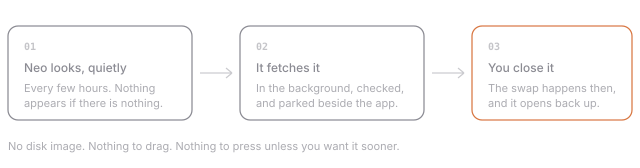

You will not download Neo again. It checks for new versions on its own, fetches them
in the background, and swaps itself over the next time you close the app — so the
version you open in the morning is the current one, and nothing was ever dragged
anywhere.

Nothing interrupts you. There is no dialog in the middle of a Tuesday and no *Later*
to press for the ninth time; the only thing that ever appears unasked is one quiet
button in the corner of the header, saying the new version is ready whenever you are.
If you would rather be asked first, or never looked for at all, that is in
**Settings › Updates** — where you will also find every changelog, including this one,
for the week later when you want to remember what moved.

## Neo has to ask for its permissions back

Once per update, and this is the honest part. Neo is signed without an Apple developer
certificate, and macOS remembers what an app is allowed to do against that signature —
which is rebuilt from scratch with every release. So after each update your Mac has
genuinely never met this copy of Neo before, and the microphone, the audio tap and
notifications are all forgotten.

Rather than let those lapse silently — and find out three weeks later, in a recording
with only your half of the call in it — the screen that tells you what changed hands
all three back, with a button each. It takes a few seconds and then it is done.

## Also in this release

- **Today has a front page of its own.** A banner, a line about you, your links and the
  weather where you are — per workspace, and yours to arrange, because none of it is
  something the app derives an answer from.
- **A deadline says so the morning it matters.** One notification, once a day, at an
  hour you choose. Never one per card, and never twice.
- **Liquid Glass**, if you want the desktop showing through the window, with a slider
  for how much.
- **Projects file into folders**, group into named bands that stay on the page, and can
  be dragged into whatever order you actually think in.
- **The assistant shows its work** while it does it, rather than after.
- **The sidebar takes the project's colour**, mixed properly, so an orange project no
  longer reads as pink.
- **The mark is on screen while the database opens**, instead of a bouncing dock icon.
